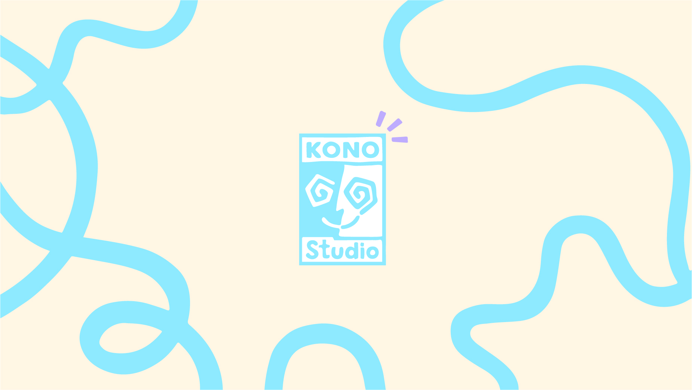

<h1 align="center">💠 Hola :P 👋¡Soy Pablo Medina Gonzalez! 💠</h1>

  

 

<h1 align="center">𝗦𝗢𝗕𝗥𝗘 𝗠𝗜</h1> 

<ul>
  <li> 🔭 Actualmente trabajando como <b>Freelance</b></li>
  <li>🚀Impulsor y mente detrás de <b>Kono Studio</b></li>
  <li> 📫 Cómo contactarme: <b>konostudio.es@gmail.com</b> <b>+34 694 22 32 74</b> </li>
</ul>

 

<h1 align="center">𝗖𝗢𝗡𝗢𝗖𝗜𝗠𝗜𝗘𝗡𝗧𝗢𝗦</h1>

  

    Estudiante y desarrollador freelance apasionado por la programación, la edición de video y la tecnología, trabajando como freelance y en proyectos personales, explorando nuevas herramientas. 
  

  

    
    
    
    
    
    
    
    
    
    
    
    
    
    
    
  

  

 

<h1 align="center">𝗥𝗘𝗗𝗘𝗦 𝗦𝗢𝗖𝗜𝗔𝗟𝗘𝗦 𝗬 𝗪𝗘𝗕</h1>

  
  
  
  
  
  

   
  

    
  

<h1 align="center"></h1>

              
